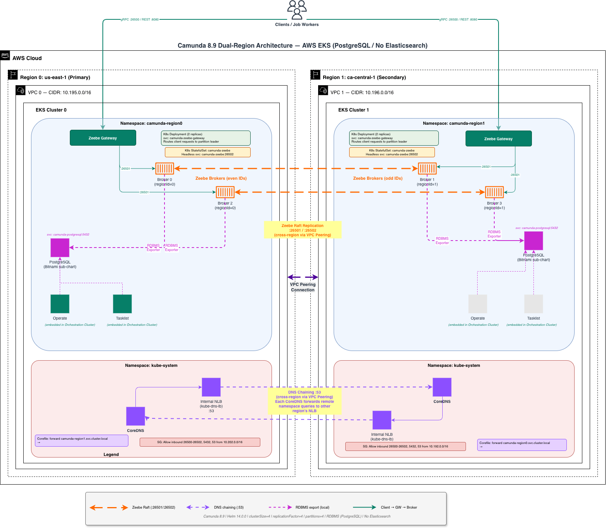

# Camunda 8.9 Dual-Region Operations Playbook

## Overview

This playbook covers the architecture and operational procedures for a Camunda 8.9 dual-region deployment on AWS EKS. It is based on the [official Camunda dual-region documentation](https://docs.camunda.io/docs/next/self-managed/concepts/multi-region/dual-region/) and lessons learned from testing with this recipe.

**Recipe:** `recipes/camunda/dual-region-rdbms-postgres`
**Infrastructure:** `recipes/aws/eks-dual-region`

---

## Architecture




**Key design points:**
- In Camunda 8.9, Operate and Tasklist are bundled into the `orchestration` component — there are no separate deployments; both are accessed via the `camunda-zeebe-gateway` service on port 8080
- Client traffic (Operate, Tasklist, REST API) is directed to **region 0** under normal operation — region 1 is not a user-facing entry point
- RDBMS (PostgreSQL) as secondary storage — no Elasticsearch dependency
- Zeebe brokers in both regions participate in Raft consensus and can hold partition leadership (see [Replication vs Request Processing](#replication-vs-request-processing) below)
- VPC peering enables cross-region pod-to-pod communication
- CoreDNS chaining enables cross-cluster service DNS resolution
- Namespaces MUST differ between clusters — CoreDNS routes by namespace

### Replication vs Request Processing

The term "active-active" in Camunda's documentation refers specifically to the **Raft replication layer**, not to client-facing request routing.

**Client requests (commands)** flow into region 0 only — through the `camunda-zeebe-gateway` service on port 8080, which serves the Zeebe REST API, Operate, and Tasklist. In Camunda 8.9 these are bundled into the `orchestration` component; there are no separate Operate or Tasklist services. Region 1 runs the same bundled component but is not exposed as a user-facing entry point under normal operation.

**Raft replication** is active in both regions. Zeebe's Raft protocol distributes partition leadership across all 4 brokers (2 per region). A partition leader in region 1 may process commands that were submitted via region 0's gateway — the gateway routes them cross-region transparently via VPC peering and CoreDNS. This cross-region routing is invisible to the client.

```
Client → Region 0 Gateway → [routes internally] → Partition Leader (may be in Region 1)
                                                         ↓
                                               Replicates via Raft to all 4 brokers
```

**How this differs from the old active-passive mode:**

In the old approach (pre-8.7), region 1 brokers were Raft *followers only* — they never held partition leadership, so no command processing happened there at all. In active-active mode, region 1 brokers *can* hold leadership for some partitions, making full use of both clusters' compute. But client traffic still enters through region 0.

| | Active-Active (this recipe) | Old Active-Passive |
|---|---|---|
| Client entry point | Region 0 only | Region 0 only |
| Region 1 brokers | Hold partition leadership, process commands | Followers only, never hold leadership |
| Resource utilization | Both clusters utilized for processing | Region 1 mostly idle |
| Tasklist requirement | **Tasklist V2** (stateless, idempotent) | Either version |
| API requirement | **v2 REST API** | v1 gRPC API also works |
| Failover trigger | Quorum lost when region isolated | Same |

> **Important:** Even in active-active mode, losing an entire region drops quorum (3 of 4 brokers required). Processing stops until failover is executed or connectivity is restored. Neither region can independently continue processing in isolation. See [Failure Scenarios](#failure-scenarios).
>
> **References:** [Dual-region concept](https://docs.camunda.io/docs/next/self-managed/concepts/multi-region/dual-region/) · [Component support matrix](https://docs.camunda.io/docs/next/self-managed/concepts/multi-region/dual-region/#camunda-components-support)

### Networking: VPC Peering + DNS Chaining

Cross-region connectivity is a two-layer problem: IP routing and DNS.

**Layer 1 — VPC Peering (IP routing)**
`configure-vpc-peering` creates a VPC peering connection between the two EKS VPCs and adds routes to every route table in each VPC so that pod CIDRs are reachable across the link.

**Layer 2 — CoreDNS chaining (service discovery)**
Pods reference each other by Kubernetes service DNS names (e.g., `camunda-zeebe.camunda-region1.svc.cluster.local`). For region 0 to resolve names in region 1's cluster, `configure-dns` does two things:

1. **Deploys `internal-dns-lb.yml` in each cluster** — this creates a `kube-dns-lb` Service of type `LoadBalancer` (internal AWS NLB) in `kube-system`. The NLB exposes `kube-dns` on TCP port 53 with a stable private IP reachable across the peering link.

   > AWS NLBs do not support mixed TCP/UDP on the same port, so only TCP 53 is exposed. CoreDNS forwarding uses `force_tcp` to match.

2. **Patches the CoreDNS ConfigMap in each cluster** — adds a forwarding stub zone for the remote cluster's namespace. For example, region 0's CoreDNS is told: *"for any query ending in `camunda-region1.svc.cluster.local`, forward to the NLB IP in region 1."* This lets Zeebe brokers resolve each other's service names across clusters without any application-level config changes.

**Limitations:**
- Identity (multi-tenancy, RBAC) not available in dual-region
- Optimize not supported
- OpenSearch not supported
- Web Modeler not covered
- Connectors can be deployed but require idempotency handling
- Not production-ready without ingress, TLS, and proper secret management

---

## Cluster Topology

| Property | Value |
|---|---|
| **clusterSize** | 4 (total across both regions) |
| **Brokers per region** | 2 (chart divides clusterSize by regions) |
| **replicationFactor** | 4 |
| **partitionCount** | 4 |
| **Node ID formula** | `podIndex * regions + regionId` |

**Broker distribution:**

| Pod | Region | Node ID | Partitions |
|---|---|---|---|
| `camunda-zeebe-0` | Region 0 | 0 | 1, 2, 3, 4 |
| `camunda-zeebe-1` | Region 0 | 2 | 1, 2, 3, 4 |
| `camunda-zeebe-0` | Region 1 | 1 | 1, 2, 3, 4 |
| `camunda-zeebe-1` | Region 1 | 3 | 1, 2, 3, 4 |

Zeebe distributes partition leadership in a round-robin fashion. With `replicationFactor: 4`, every partition is replicated to all 4 brokers. Quorum requires 3 of 4 brokers — losing an entire region (2 brokers) means quorum is lost.

---

## Day-to-Day Operations

### Access Operate and Tasklist

Operate and Tasklist are bundled into the `orchestration` component in Camunda 8.9 — they share the `camunda-zeebe-gateway` service. There are no separate `camunda-operate` or `camunda-tasklist` services.

```bash
# Port-forward the gateway service (serves REST API + Operate + Tasklist UI)
kubectl --context <cluster-0> -n <namespace-0> \
  port-forward svc/camunda-zeebe-gateway 8080:8080

# Then open in browser:
#   Operate:  http://localhost:8080/operate
#   Tasklist: http://localhost:8080/tasklist
#   REST API: http://localhost:8080/v2/topology
```

### Check Cluster Health

```bash
# Check topology via region 0 (port-forwards the Zeebe gateway internally)
make topology

# Or check pods in each region
make pods-region0
make pods-region1
```

**Healthy topology indicators:**
- All 4 brokers visible (nodeId 0, 1, 2, 3)
- Each partition has exactly one `leader` and three `follower` roles
- All partitions report `health: "healthy"`

### View Pods in Each Region

```bash
make pods-region0
make pods-region1
```

### Switch kubectl Context

```bash
make use-region0
make use-region1
```

---

## Failure Scenarios

### Scenario 1: Network Partition (VPC Route Loss)

**Cause:** Network connectivity between regions is lost (e.g., VPC peering route deleted, network outage).

**Symptoms:**
- Broker logs: `Failed to resolve DNS` or `Member unreachable` for cross-region brokers
- Topology shows only local brokers (2 instead of 4)
- All partitions become `follower` — no leaders elected (quorum lost)
- API calls fail: `"Expected to handle request, but there was a connection error with one of the brokers"`

**Simulate:**

```bash
make simulate-partition \
  CLUSTER_0=<cluster-0> CLUSTER_1=<cluster-1> \
  AWS_REGION_0=<region-0> AWS_REGION_1=<region-1>
```

**Impact:**
- Processing **stops immediately** — no new instances, no task completion
- Existing data is safe (Raft log is durable on each broker)
- RDBMS exporter stalls — search APIs return stale data
- Both regions' pods remain running

**Restore:**

```bash
make restore-partition \
  CLUSTER_0=<cluster-0> CLUSTER_1=<cluster-1> \
  AWS_REGION_0=<region-0> AWS_REGION_1=<region-1>
```

**Recovery behavior:**
- Zeebe automatically detects restored connectivity (SWIM protocol probes every 2s)
- Raft re-establishes quorum and elects leaders (30-60 seconds)
- RDBMS exporter catches up on backlog
- No manual intervention required beyond restoring network

**Verify recovery:**

```bash
# Wait 60 seconds, then:
make topology
make pods-region0
make pods-region1
```

---

### Scenario 2: Region Broker Crash

**Cause:** Broker pods in one region crash or are evicted.

**Symptoms:** Same as network partition — quorum lost, processing stops.

**Recover:**

```bash
# If pods are in CrashLoopBackOff, delete them to force restart:
kubectl --context <cluster-1> -n <namespace-1> delete pods -l app.kubernetes.io/component=zeebe-broker

# Watch recovery:
kubectl --context <cluster-1> -n <namespace-1> get pods -w
```

Brokers will restart with existing PVC data and rejoin the Raft cluster.

---

### Scenario 3: Full Region Loss

**Cause:** Entire region is unavailable (AWS outage, cluster deleted).

**Impact:**
- Zeebe quorum lost — processing stops
- Primary region loss: user traffic unavailable
- Secondary region loss: user traffic unaffected but processing stops

**Recovery — Failover (Temporary):**

Follow the [official Camunda failover procedure](https://docs.camunda.io/docs/next/self-managed/deployment/helm/operational-tasks/dual-region-operational-procedure/):

1. Scale surviving region to handle solo operation (failover mode)
2. Redirect user traffic to surviving region if primary was lost
3. Processing resumes in degraded mode

**Recovery — Failback (Permanent):**

1. Restore or recreate the failed region's EKS cluster
2. Redeploy Camunda brokers in failback mode
3. Wait for data replication to complete
4. Resume normal dual-region operation
5. Remove failover configuration

> **Important:** The failover/failback procedures are complex and should be tested in non-production environments before relying on them. Refer to the official docs for detailed steps.

---

### Scenario 4: Authorization Distribution Failure

**Cause:** User authorizations (e.g., `demo/demo`) fail to replicate across partitions after a partition event.

**Symptoms:**
- One region returns `401 Unauthorized` on API calls
- Logs show: `Not sending command AUTHORIZATION CREATE to <partition>, no known leader`
- `CommandRedistributor` retrying authorization distribution

**Recover:**

```bash
# Restart brokers in the affected region to force redistribution:
kubectl --context <cluster> -n <namespace> delete pods -l app.kubernetes.io/component=zeebe-broker
```

Wait 60 seconds for pods to restart and authorizations to propagate, then retry API calls.

---

### Scenario 5: RDBMS Exporter Stall

**Cause:** Exporter falls behind after partition recovery or PostgreSQL issues.

**Symptoms:**
- `get-instances` returns stale data (missing recently created instances)
- Direct lookup by key returns 404
- Logs show: `Partition-N failed, marking it as unhealthy` then `Partition-N recovered, marking it as healthy`

**Recover:**

Typically self-resolves as the exporter catches up. If stalled for more than 5 minutes:

```bash
# Check exporter status:
kubectl --context <cluster> -n <namespace> logs <zeebe-pod> | grep -i "export\|rdbms"

# If necessary, restart the statefulset:
kubectl --context <cluster> -n <namespace> rollout restart statefulset camunda-zeebe
```

---

## Recovery Time Expectations

| Scenario | RPO | RTO |
|---|---|---|
| Network partition (restored) | 0 | 30-60 seconds after connectivity restored |
| Broker pod restart | 0 | 1-3 minutes |
| Full region failover | 0 | < 1 minute (excluding DNS reconfiguration) |
| Full region failback | 0 | 5+ minutes (depends on data volume) |
| RDBMS exporter catch-up | 0 | 1-5 minutes after partition recovery |

---

## Key Make Targets Reference

### Infrastructure (from `recipes/aws/eks-dual-region/`)

| Target | Description |
|---|---|
| `make -C region0` | Create EKS cluster in region 0 |
| `make -C region1` | Create EKS cluster in region 1 |
| `make` | VPC peering + DNS chaining (run after both clusters exist) |
| `configure-vpc-peering` | Full VPC peering setup |
| `configure-dns` | DNS chaining between clusters |
| `test-dns` | Verify cross-region DNS |
| `add-contexts` | Add both clusters to kubeconfig |
| `clean-vpc-peering` | Remove VPC peering |
| `make -C region0 clean` | Delete region 0 EKS cluster |
| `make -C region1 clean` | Delete region 1 EKS cluster |

### Camunda (from `recipes/camunda/dual-region-rdbms-postgres/`)

| Target | Description |
|---|---|
| `make -C region0` | Deploy Camunda to region 0 |
| `make -C region1` | Deploy Camunda to region 1 |
| `make -C region0 clean` | Uninstall Camunda from region 0 |
| `make -C region1 clean` | Uninstall Camunda from region 1 |
| `topology` | Check Zeebe cluster topology via region 0 |
| `use-region0/1` | Switch kubectl context |
| `pods-region0/1` | List pods per region |
| `simulate-partition` | Remove VPC routes (simulate outage) |
| `restore-partition` | Re-add VPC routes (restore connectivity) |

---

## Network Requirements

| Port | Protocol | Purpose |
|---|---|---|
| 26500 | TCP | Zeebe Gateway (client/worker communication) |
| 26501 | TCP | Zeebe internal (broker ↔ gateway) |
| 26502 | TCP | Zeebe internal (broker ↔ broker) |
| 5432 | TCP | PostgreSQL |
| 8080 | TCP | REST API |
| 53 | TCP | DNS (CoreDNS cross-cluster forwarding via internal NLB; `force_tcp`) |

Maximum network RTT between regions: **100ms**.

---

## Limitations

- **Identity:** Management Identity (multi-tenancy, RBAC) not available in dual-region. Cluster-level Identity via Orchestration is supported.
- **Optimize:** Not supported in dual-region.
- **Connectors:** Can be deployed but idempotency must be managed to avoid event duplication.
- **Web Modeler:** Not covered; has dependency on Management Identity.
- **OpenSearch:** Not supported in dual-region configurations.
- **Upgrades:** Use staged approach — upgrade one region at a time. Never upgrade both simultaneously.

---

## Further Reading

- [Dual-region concept](https://docs.camunda.io/docs/next/self-managed/concepts/multi-region/dual-region/)
- [AWS EKS dual-region setup](https://docs.camunda.io/docs/next/self-managed/deployment/helm/cloud-providers/amazon/amazon-eks/dual-region/)
- [Failover/failback operational procedure](https://docs.camunda.io/docs/next/self-managed/deployment/helm/operational-tasks/dual-region-operational-procedure/)
- [Camunda c8-multi-region test repo](https://github.com/camunda/c8-multi-region)
- [camunda-8-helm-profiles (dave-2026 branch)](https://github.com/camunda-community-hub/camunda-8-helm-profiles/blob/dave-2026/)